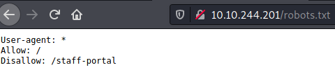
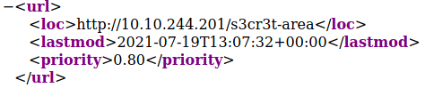
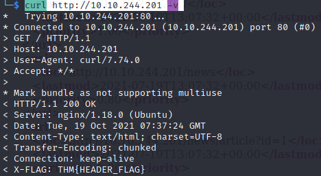
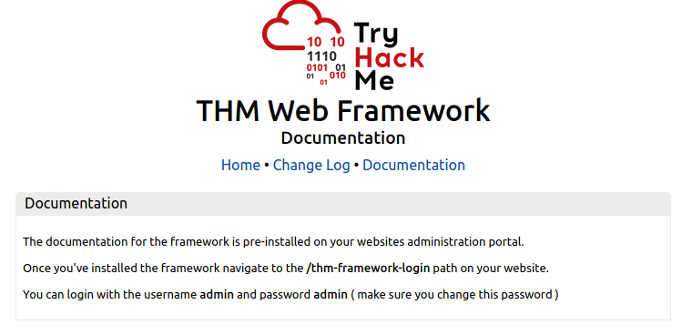

Link to room: https://tryhackme.com/room/contentdiscovery

# Questions:

- Task 1
	- What is the Content Discovery method that begins with M?
		- Manually
	- What is the Content Discovery method that begins with A?
		- Automated 
	- What is the Content Discovery method that begins with O?
		- OSINT

- Task 2
	- What is the directory in the robots.txt that isn't allowed to be viewed by web crawlers?
		- How to get the answer?
			- http://xx.xx.xxx.xxx/robots.txt 
		- Answer: /staff-portal

- Task 3
	- What framework did the favicon belong to?
		- How to get the answer?
			1. curl https://static-labs.tryhackme.cloud/sites/favicon/images/favicon.ico | md5sum
			2. curl https://wiki.owasp.org/index.php/OWASP_favicon_database | grep \<output of command\>
		- Why does this work and how could it not work?
			- This works because they did not change the default favicon of their web application
			- If they change it from the default, it will not work
		- Answer: cgiirc

- Task 4	
	- What is the path of the secret area that can be found in the sitemap.xml file?
		- How to get the answer?
			1. http://xx.xx.xxx.xxx/sitemap.xml 
		- Answer: /s3cr3t-area

- Task 5
	- What is the flag value from the X-FLAG header?
		- How to get the flag?
			1. curl http://xx.xx.xxx.xxx -v 
		- Flag: THM{HEADER_FLAG}

- Task 6
	- What is the flag from the framework's administration portal?
		- How to get the flag?
			1. view-source:http://xx.xx.xxx.xxx
			2. https://static-labs.tryhackme.cloud/sites/thm-web-framework
			3. https://static-labs.tryhackme.cloud/sites/thm-web-framework/documentation.html 
			4. http://xx.xx.xxx.xxx/thm-framework-login
			5. admin:admin
		- Flag: THM{CHANGE_DEFAULT_CREDENTIALS}

- Task 7
	- What Google dork operator can be used to only show results from a particular site?
		- Answer: site:

- Task 8
	- What online tool can be used to identify what technologies a website is running?
		- Answer: Wappalyzer

- Task 9
	- What is the website address for the Wayback Machine?
		- Answer: https://archive.org/web/

- Task 10
	- What is Git?
		- Answer: version control system

- Task 11
	- What URL format do Amazon S3 buckets end in?
		- Answer: .s3.amazonaws.com

- Task 12
	- What is the name of the directory beginning "/mo...." that was discovered?
		- How to get the answer
			1. feroxbuster --url http://xx.xx.xxx.xxx/
		- Answer: /monthly
	- What is the name of the log file that was discovered?
		- How to get the answer
			1. feroxbuster --url http://xx.xx.xxx.xxx/ -w /usr/share/seclists/Discovery/Web-Content/common.txt   
		- Answer: /development.log