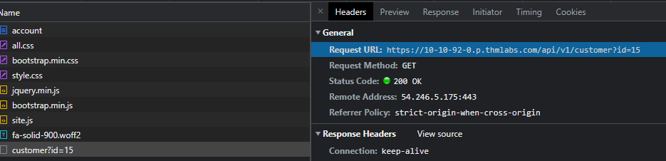

Link to room: https://tryhackme.com/room/idor

# Questions:

- Task 1
	- What does IDOR stand for? 
		- Insecure Direct Object Reference

- Task 2
	- What is the Flag from the IDOR example website?
		- THM{IDOR-VULN-FOUND}

- Task 3
	- What is a common type of encoding used by websites?
		- Base64

- Task 4	
	- What is a common algorithm used for hashing IDs?
		- MD5

- Task 5
	- What is the minimum number of accounts you need to create to check for IDORs between accounts?
		- 2

- Task 6
	- Read the above.
		- No answer needed

- Task 7
	- What is the username for user id 1?
		- How to get answer
			1. Create account 
			2. F12 -> Network
			3. Click "Your Account"
			4. Look for customer?id= file 
			5. Copy url and change to 1
				- https://10-10-92-0.p.thmlabs.com/api/v1/customer?id=1
		- Answer: 
			- adam84
	- What is the username for user id 3?
		- How to get answer
			1. Same as above but change to 3
				- https://10-10-92-0.p.thmlabs.com/api/v1/customer?id=3
		- Answer: 
			- j@fakemail.thm