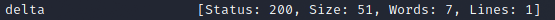

Link to room: https://tryhackme.com/room/subdomainenumeration

# Questions:

- Task 1
	- What is a subdomain enumeration method beginning with B?
		- Brute Force
	- What is a subdomain enumeration method beginning with O?
		- OSINT
	- What is a subdomain enumeration method beginning with V?
		- Virtual Host

- Task 2
	- What domain was logged on crt.sh at 2020-12-26?
		- store.tryhackme.com 

- Task 3
	- What is the TryHackMe subdomain beginning with **B** discovered using the above Google search?
		- blog.tryhackme.com 

- Task 4	
	- What is the first subdomain found with the dnsrecon tool?
		- api.acmeitsupport.thm 

- Task 5
	- What is the first subdomain discovered by sublist3r?
		- web55.acmeitsupport.thm 

- Task 6
	- What is the first subdomain discovered?
		- How to get the answer?
			- ffuf -w /usr/share/seclists/Discovery/DNS/namelist.txt -H "Host: FUZZ.acmeitsupport.thm" -u http://xx.xx.xxx.xxx -fs 2395 
		- Answer
			- delta 
	- What is the second subdomain discovered?
		- How to get the answer?
			- ffuf -w /usr/share/seclists/Discovery/DNS/namelist.txt -H "Host: FUZZ.acmeitsupport.thm" -u http://xx.xx.xxx.xxx -fs 2395 
		- Answer
			- yellow 
